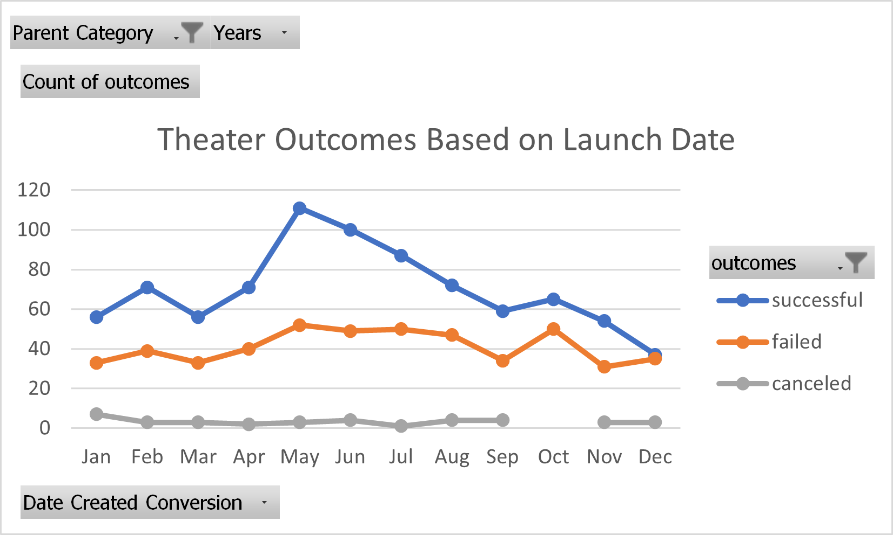

# An Analysis of Kickstarter Campaigns

## Overview of Project
Snapshot of Kickstarter Campaign based on Louise's requirements and what were the findings.

### Purpose
Louise’s play Fever came close to its fundraising goal in a short amount of time. This analysis will help with understanding how different campaigns fared in relation to their launch dates and their funding goals.

## Analysis and Challenges

### Analysis of Outcomes Based on Launch Date

Campaigns were analysed by month to show the most popular/successful plays. There were 1393 shows played in last few years. The outcome varies widely based on the month when the show was played. There were more shows played during the May and June than in November/December time frame.

### Analysis of Outcomes Based on Goals

Campaigns were designed with different goals in mind. The goals were to measure the success of the campaign when fund is raised in the following categories:
- Less than 1000
- 1000 to 4999
- 5000 to 9999
- 10000 to 14999
- 15000 to 19999
- 20000 to 24999
- 30000 to 34999
- 35000 to 39999
- 40000 to 44999
- 45000 to 50000
- 50000 and above
 
### Challenges and Difficulties Encountered

## Results

- What are two conclusions you can draw about the Outcomes based on Launch Date?

    - The plays were most successful during the month of May and June and hence created more funding.
    - The shows were failed the most in the month of October and December.

- What can you conclude about the Outcomes based on Goals?

    - Louise’s campaign are very successful with a smaller goal upto $5000(success ratio: 72%), rather than having huge goals of $50,000. 
    - The second most successful goal was between $35,000 to $44,999 (success ratio: 66.7%)

- What are some limitations of this dataset?
    - The dataset has shows which are successful, failed, or live. It is not possible to predict the outcome of live shows.

- What are some other possible tables and/or graphs that we could create?
    - Theater Outcomes Based On Launch Date chart could have been created to show data in percentages vs numbers.
    - Theater Outcomes Based On Launch Date chart could have been created to show data per year as last three years (2014-2016) had more failures. We could have identified some other interesting data.

- Resources:
    - [Theater Outcomes Based On Launch Date](resources/Theater_Outcomes_vs_Launch.png)
    - [Outcomes Based On Goals](resources/Outcomes_vs_Goals.png)
